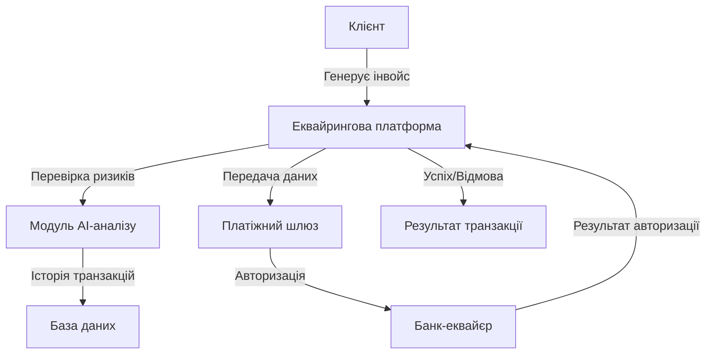

```mermaid
graph TD
    A[Клієнт] -->|Генерує інвойс| B[Еквайрингова платформа]
    B -->|Перевірка ризиків| C[Модуль AI-аналізу]
    C -->|Історія транзакцій| D[База даних]
    B -->|Передача даних| E[Платіжний шлюз]
    E -->|Авторизація| F[Банк-еквайєр]
    F -->|Результат авторизації| B
    B -->|Успіх/Відмова| G[Результат транзакції]
```