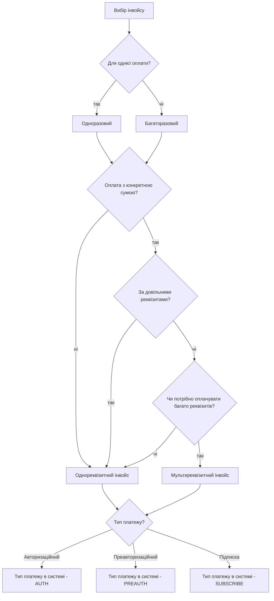

```mermaid
flowchart TB
  A[Вибір інвойсу] --> B{Для однієї оплати?}
  B -->|так| C[Одноразовий]
  B -->|ні| D[Багаторазовий]
  C --> E{Оплата з конкретною сумою?}
  D --> E
  E -->|так| F{За довільними реквізитами?}
  E -->|ні| J[Однореквізитний інвойс]
  F -->|так| J
  F -->|ні| K{Чи потрібно оплачувати багато реквізитів?}
  K -->|так| G[Мультиреквізитний інвойс]
  K -->|ні| J
  J --> S{Тип платежу?}
  G --> S
  S -->|Авторизаційний| Z[Тип платежу в системі - AUTH]
  S --> |Преавторизаційний| X[Тип платежу в системі - PREAUTH]
  S -->|Підписка| V[Тип платежу в системі - SUBSCRIBE]

```