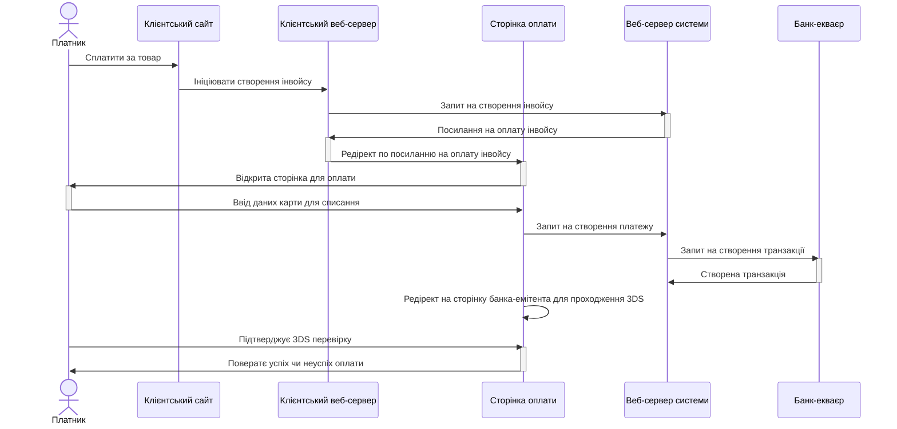

```mermaid
sequenceDiagram
  actor P as Платник
  participant CBW as Клієнтський сайт
  participant CB as Клієнтський веб-сервер
  participant IP as Сторінка оплати
  participant B as Веб-сервер системи
  participant BE as Банк-екваєр
  P ->> CBW: Сплатити за товар
  CBW ->> CB: Ініціювати створення інвойсу
  CB ->> B: Запит на створення інвойсу
  activate B
  B ->> CB: Посилання на оплату інвойсу
  deactivate B
  activate CB
  CB ->> IP: Редірект по посиланню на оплату інвойсу
  deactivate CB
  activate IP
  IP ->> P: Відкрита сторінка для оплати
  deactivate IP
  activate P
  P ->> IP: Ввід даних карти для списання
  deactivate P
  IP ->> B: Запит на створення платежу
  
  B ->> BE: Запит на створення транзакції
  activate BE
  BE ->> B: Створена транзакція
  deactivate BE
  
  IP ->> IP: Редірект на сторінку банка-емітента для проходження 3DS

  P ->> IP: Підтверджує 3DS перевірку
  activate IP
  IP ->> P: Повератє успіх чи неуспіх оплати
  deactivate IP

```