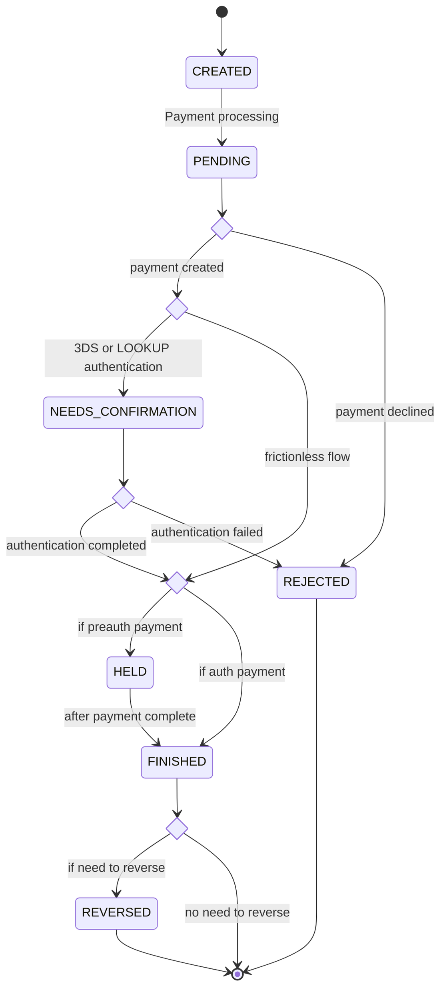

```mermaid
stateDiagram
    state if_ff <<choice>>
    state if_auth <<choice>>
    state if_pending <<choice>>
    state if_reverse <<choice>>
    state if_needs <<choice>>
    [*] --> CREATED
    CREATED --> PENDING : Payment processing
    PENDING --> if_pending
    if_pending --> if_ff: payment created
    if_pending --> REJECTED: payment declined
    if_ff --> NEEDS_CONFIRMATION: 3DS or LOOKUP authentication
    if_ff --> if_auth: frictionless flow
    NEEDS_CONFIRMATION --> if_needs
    if_needs --> if_auth: authentication completed
    if_needs --> REJECTED: authentication failed
    if_auth --> HELD: if preauth payment
    if_auth --> FINISHED: if auth payment
    HELD --> FINISHED: after payment complete
    FINISHED --> if_reverse
    if_reverse --> REVERSED: if need to reverse
    if_reverse --> [*]: no need to reverse
    REJECTED --> [*]
    REVERSED --> [*]
```